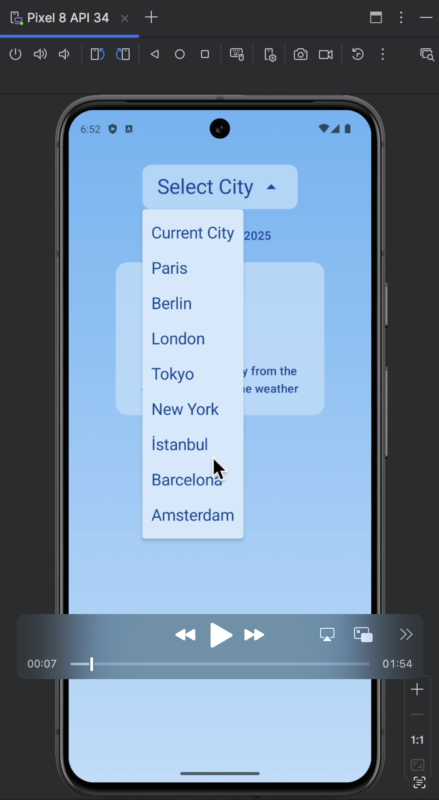
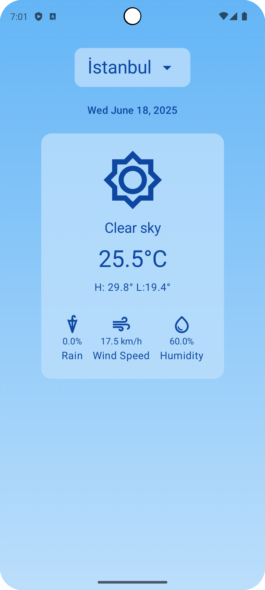
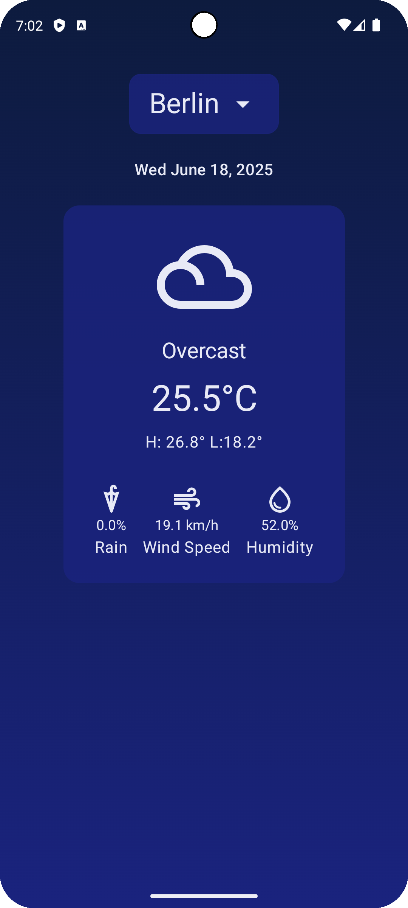

# WeatherApp – COMP 319A Project 3

This is a Jetpack Compose-based Weather app for Android developed as part of Koç University's COMP 319A - Mobile Device Programming course.  
It fetches current weather data, displays location-based weather information, and provides an intuitive user interface.

---

## 🔧 Features

- Fetch current weather data from the Open-Meteo API using Retrofit
- Display current temperature, weather condition, and visual indicators
- Show detailed weather information (wind speed, humidity, precipitation probability)
- Weather condition icons with comprehensive weather code translations
- Daily high & low temperature display
- Modern gradient background with dark/light theme support
- Error handling with user-friendly messages
- Dynamic current date display
- GPS location detection and reverse geocoding
- City dropdown menu for selecting different locations

---

## 🎥 Demo & Screenshots

### Demo Video
Watch our app in action! The demo shows the app's core functionality including location detection, city selection, and theme switching.

<a href="media/project3 demo video.mov">
  
</a>

*Click the thumbnail above to watch the full demo video*

### Light Theme Screenshot


*WeatherApp in light mode showing current weather information for Istanbul*

### Dark Theme Screenshot  


*WeatherApp in dark mode showing current weather information for Berlin*

---

## 📱 Usage Instructions

### Current Functionality

**Main Screen**: Displays comprehensive weather information
- **Current Location**:
  - Automatically detected via GPS with reverse geocoding using 
**Geocoder** provided by Android.
  - When the app starts, it asks for permission to access your location. If you decline, you can still use the app to view weather for other cities. If you later want to enable current location, the app will show the permission dialog again when you select the current location option from dropdown menu.
  
- **City Selection**: Dropdown menu allows choosing from:
  - Current detected location (default)
  - Major world cities: Paris, Berlin, London, Tokyo, New York, İstanbul, Barcelona, Amsterdam
  - We used Geocoder from the Android SDK. In this part, geocoder takes the name of the city and returns the latitude and longitude so the weather API can return data.
  
- **Weather Display**: Updates automatically when a different city is selected
  - Current temperature with weather condition icon
  - Weather condition label (Clear Sky, Partly Cloudy, Rainy, etc.)
  - Daily high and low temperatures
  - Detailed metrics: Rain probability, Wind speed, Humidity

- **Theme Support**:
    - Automatically adapts to system dark/light mode
    - Beautiful gradient backgrounds that change with the theme

- **Error Handling**:
    - Displays friendly error messages when API calls fail
    - Shows alternative icons and messages for missing data

---

## 🗃️ Technologies Used

- **Kotlin & Jetpack Compose** - Modern Android UI toolkit
- **Retrofit & Moshi** - REST API client and JSON parsing
- **Open-Meteo Weather API** - Free weather data service (no API key required)
- **MVVM Architecture** - ViewModel + Repository pattern
- **Coroutines & LiveData** - Asynchronous programming and state management
- **Material3 UI Components** - Modern Material Design system

---

## ❔ How We Handle Weather App Logic & Added UI State

First, we decided on the UI design. We chose to use Material Design Cards to organize all the weather information we retrieve from the API into their designated places. After finalizing our desired UI design, we began implementing the Weather API integration to fetch weather information from specific latitude and longitude coordinates. We store the API configuration (base URL and endpoints) in the `data` folder within the `Constants.kt` file and connect to the weather API through the `WeatherApi` class. After successfully connecting to the Weather API, we use the **WeatherApiService** class to send requests and retrieve specific weather information from the API.

After successfully demonstrating that we could connect to the Weather API, we started working on obtaining the current location of the user. We used **FusedLocationProvider** for this purpose. We also referenced the sample code as guidance while implementing the **LocationService** in our app. The location service functionality can be summarized as follows:

- Get the current location of the user using **FusedLocationProvider** if the user accepts sharing their location information with the app.
- If location permission is denied, the app only shows weather information for other cities from the dropdown menu.
- When a user clicks on "Current City" while having previously dismissed the location permission request, the app shows the location permission dialog again and asks if the user wants to share their location information now. (This is implemented using the **resetPermissionDialogShown()** function in the ViewModel, which resets the permission dialog state when the user clicks on the current location option without having granted location permission.)
- If the user accepts sharing their location information with the app, they can easily see their current location weather alongside all other available locations. Using UI state management, we ensure the state of the UI is preserved when the app context changes due to user interactions.

Next, we implemented the Geocoder to support our city dropdown functionality. When a user selects a city from the dropdown, the UI displays weather information for that specific city. We chose the Geocoder provided by the Android SDK since it's free and easy to use. The Geocoder serves two main purposes: First, it provides the city name after we obtain the location latitude and longitude from **FusedLocationProvider**. Since longitude and latitude coordinates aren't easily understood by users, we needed reverse geocoding to convert coordinates to readable city names. Second, we need to provide latitude and longitude coordinates for cities chosen by the user through the dropdown menu, so we use forward geocoding to convert the city name to coordinates and provide this information to the weather API using state variables.

---

## 🚀 Setup & Run

1. Clone the repo from GitHub Classroom
2. Open in Android Studio (Giraffe or newer)
3. Make sure you're using:
    * Target API level 28+ (Android 9)
    * Kotlin `2.0.21+`
    * AGP `8.9.1+`
4. Build & run on emulator or physical device (Android 13+ recommended)
5. **No API key required** - uses free Open-Meteo service

---

## 👥 Authors

* **Bensu Özyurt** - Location service, GPS implementation, and UI design
* **Sinemis Toktaş** - API integration, weather data handling, and UI design

---

## 📄 License

This project is for educational purposes only.

---

## 📚 External Resources Used

This project was developed using a combination of course slides, official Android documentation, and external resources.

### 📘 Course Materials

* **COMP 319A** slides, especially:
  * App Architecture
  * Repository Pattern
  * Connect to the internet
  * Jetpack Compose UI components

### 🌐 Official Android Documentation

* **Gradient Backgrounds in Compose**
  * [https://developer.android.com/develop/ui/compose/graphics/draw/brush](https://developer.android.com/develop/ui/compose/graphics/draw/brush)
  * Used for implementing gradient background colors with theme support

### 🌤️ Weather API Resources

* **Open-Meteo Weather API**
  * [https://open-meteo.com/en/docs#daily_parameter_definition](https://open-meteo.com/en/docs#daily_parameter_definition)
  * Used for weather data fetching and API parameter configuration

### 📍 Location Permission
  * [Fused Location Provider](https://developer.android.com/develop/sensors-and-location/location/retrieve-current)
  * Used to take the current location information of the user after the user gave permission to access their location. The provided sample code gave us general direction while implementing the app.
    
### 🧭 Geocoder 

  * [Geocoder website](https://developer.android.com/reference/kotlin/android/location/Geocoder)
  * Used for geocoding & reverse geocoding to visually give the user the name of the city using the latitude and longitude, and also providing weather information of the selected city by the user by returning latitude and longitude information to the weather API.
    
### 📖 Implementation Guides

* **Medium Article: Forecasting Weather with Open-Meteo API**
  * [https://medium.com/@owmo13/forecasting-weather-with-open-meteo-api-using-jetpack-compose-7e58387f10e1](https://medium.com/@owmo13/forecasting-weather-with-open-meteo-api-using-jetpack-compose-7e58387f10e1)
  * Used for API parameter configuration and Retrofit implementation patterns

### 🎨 UI Resources

* **Google Fonts & Material Icons**
  * [https://fonts.google.com/?icon.size=24&icon.color=%231f1f1f&icon.platform=android&icon.set=Material+Icons&icon.style=Filled](https://fonts.google.com/?icon.size=24&icon.color=%231f1f1f&icon.platform=android&icon.set=Material+Icons&icon.style=Filled)
  * Used for searching and selecting appropriate weather condition icons

---

## 🧠 AI Assistance

This project used [ChatGPT](https://chat.openai.com) for development guidance and writing this README file. Below are the recorded prompts and the corresponding ChatGPT suggestions & code snippets that we incorporated into our Weather App.

### 1. Icon Implementation Best Practices

**Prompt:**
```
what is the best way to use and find icons
```

**ChatGPT Response:**
> **Use Icons.Filled.X (Material Icons in Code)**
> Best for: Speed, theming, built-in styling
>
> ```kotlin
> import androidx.compose.material.icons.Icons
> import androidx.compose.material.icons.filled.WbSunny
> 
> Icon(Icons.Filled.WbSunny, contentDescription = "Sunny")
> ```
>
> To access more icons:
> * Add this in build.gradle: `implementation "androidx.compose.material:material-icons-extended"`
>
> Where to find icons:
> * Browse at: https://fonts.google.com/icons
> * Search for things like: wb_sunny, wb_cloudy, ac_unit, air, water_drop

*Based on this guidance, we implemented comprehensive weather condition icons in `WeatherCondition.kt` using Material Icons, but after searching icons from the website, we changed our icon type to Outlined.*

---

### 2. Dark and Light Theme Support

**Prompt:**
```
How to support dark and light mode in a Jetpack Compose app?
```

**ChatGPT Response:**
> Great question. Jetpack Compose makes it really easy to support both dark and light themes automatically — and it’s a key part of Material Design, which your course emphasizes.
Here’s how to do it properly in a weather app using course-level architecture:
>
> **Define color palettes in Color.kt:**
> ```kotlin
> val LightColorScheme = lightColorScheme(
>     primary = Blue,
>     background = White,
>     onPrimary = Black
> )
> 
> val DarkColorScheme = darkColorScheme(
>     primary = LightBlue,
>     background = Black,
>     onPrimary = White
> )
> ```

*We changed the colors from given answer and implemented our custom color scheme with gradient backgrounds that adapt to light/dark themes in `Color.kt` and `Theme.kt`.*


### 3. Adding dropdown

**Prompt:**
```
how to add a dropdown in compose
```

**ChatGPT Response:**
> Simple Dropdown Using DropdownMenu in Compose:

>```kotlin
>@Composable
>fun SimpleDropdownMenu() {
>    var expanded by remember { mutableStateOf(false) }
>    val items = listOf("Option 1", "Option 2", "Option 3")
>    var selectedIndex by remember { mutableStateOf(0) }
>
>    Box {
>        Button(onClick = { expanded = true }) {
>            Text(items[selectedIndex])
>        }
>        DropdownMenu(
>            expanded = expanded,
>            onDismissRequest = { expanded = false }
>        ) {
>            items.forEachIndexed { index, item ->
>                DropdownMenuItem(
>                    text = { Text(item) },
>                    onClick = {
>                        selectedIndex = index
>                        expanded = false
>                    }
>                )
>            }
>        }
>    }
>}
> ```
*We used the given code as a general guide and implemented our own*

**Second Prompt:**
```
the dropdown that appears is not the same size as current card 
```
**ChatGPT Response:**
> Fixed dropdown width: Add modifier = Modifier.width(IntrinsicSize.Max) to the DropdownMenu - this makes it match the width of the trigger button

*We added the given code to our UI dropdown code.*
